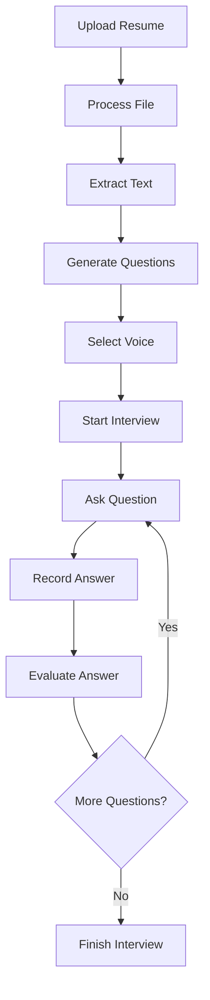

# Interview Assistant - Modular Architecture

A modern AI-powered interview system with a clean, modular ES6 architecture. This application has been refactored from a monolithic 842-line JavaScript file into 12 focused, maintainable modules.

## 🏗️ Architecture Overview

```
interview-assistant/
├── index.html                 # Main HTML file
├── js/
│   ├── main.js               # Application entry point
│   ├── config/               # Configuration files
│   │   ├── constants.js      # API keys, URLs, prompts
│   │   └── voiceModels.js    # Voice model definitions
│   ├── services/             # Core services
│   │   ├── apiService.js     # API communication (Gemini, Sarvam, OpenRouter)
│   │   ├── speechService.js  # Text-to-speech & speech recognition
│   │   ├── fileService.js    # File upload & processing (PDF/DOC)
│   │   └── recordingService.js # Audio/video recording
│   ├── managers/             # Business logic managers
│   │   ├── interviewManager.js # Interview flow & question management
│   │   ├── voiceManager.js   # Voice selection & preview
│   │   ├── uiManager.js      # UI state & stage transitions
│   │   └── timerManager.js   # Interview timing & countdown
│   └── utils/                # Utility modules
│       ├── domUtils.js       # DOM manipulation helpers
│       ├── validators.js     # Input validation utilities
│       └── formatters.js     # Data formatting utilities
├── css/                      # Stylesheets
├── images/                   # Voice model avatars
└── README.md                 # This file
```

## 📋 Module Breakdown

### Configuration Layer
- **[`constants.js`](js/config/constants.js)** - Centralized configuration for APIs, file handling, and UI messages
- **[`voiceModels.js`](js/config/voiceModels.js)** - Voice model definitions with metadata and helper functions

### Service Layer
- **[`apiService.js`](js/services/apiService.js)** - Handles all API communications with fallback mechanisms
- **[`speechService.js`](js/services/speechService.js)** - Manages text-to-speech and speech recognition
- **[`fileService.js`](js/services/fileService.js)** - Processes file uploads and extracts text from PDF/DOC files
- **[`recordingService.js`](js/services/recordingService.js)** - Manages audio/video recording and media streams

### Manager Layer
- **[`interviewManager.js`](js/managers/interviewManager.js)** - Core interview logic, question flow, and evaluation
- **[`voiceManager.js`](js/managers/voiceManager.js)** - Voice selection, preview, and management
- **[`uiManager.js`](js/managers/uiManager.js)** - UI state management and stage transitions
- **[`timerManager.js`](js/managers/timerManager.js)** - Interview timing, countdown, and time management

### Utility Layer
- **[`domUtils.js`](js/utils/domUtils.js)** - DOM manipulation and event handling utilities
- **[`validators.js`](js/utils/validators.js)** - Input validation for files, text, and user data
- **[`formatters.js`](js/utils/formatters.js)** - Data formatting for display and processing

### Entry Point
- **[`main.js`](js/main.js)** - Application initialization and module coordination

## 🚀 Key Features

### Modular Design Benefits
- **Separation of Concerns**: Each module has a single responsibility
- **Maintainability**: Easy to locate and modify specific functionality
- **Testability**: Individual modules can be unit tested
- **Reusability**: Services can be reused across different parts of the app
- **Scalability**: Easy to add new features without affecting existing code

### Technical Features
- **ES6 Modules**: Modern JavaScript module system with import/export
- **Singleton Pattern**: Services and managers use singleton instances
- **Event-Driven Architecture**: Loose coupling through callback systems
- **Error Handling**: Comprehensive error handling with user feedback
- **Resource Management**: Proper cleanup and resource management

## 🔧 API Integration

### Supported APIs
- **Gemini AI**: Primary question generation and answer evaluation
- **Sarvam AI**: Text-to-speech with multiple voice models
- **OpenRouter**: Fallback for question generation

### Voice Models
- **Female Voices**: Vidya, Anushka, Manisha, Arya
- **Male Voices**: Abhilash, Karun, Hitesh

## 📱 Application Flow



## 🛠️ Development

### Prerequisites
- Modern web browser with ES6 module support
- Local web server (for CORS compliance)

### Setup
1. Clone the repository
2. Serve files through a local web server
3. Open `index.html` in your browser

### Module Dependencies
```javascript
// Example import structure
import { apiService } from './services/apiService.js';
import { speechService } from './services/speechService.js';
import { interviewManager } from './managers/interviewManager.js';
```

## 🔒 Configuration

### API Keys
Update the API keys in [`js/config/constants.js`](js/config/constants.js):
```javascript
export const API_CONFIG = {
    GEMINI: {
        KEY: "your-gemini-api-key",
        URL: "https://generativelanguage.googleapis.com/v1beta/models/gemini-2.0-flash:generateContent"
    },
    SARVAM: {
        API_KEY: "your-sarvam-api-key"
    }
};
```

### File Upload Settings
Modify file handling settings in [`constants.js`](js/config/constants.js):
```javascript
export const FILE_CONFIG = {
    VALID_TYPES: ["application/pdf", "application/msword"],
    MAX_SIZE: 10 * 1024 * 1024, // 10MB
    PREVIEW_LENGTH: 1000
};
```

## 🧪 Testing

### Manual Testing
1. Upload a resume file (PDF/DOC/DOCX)
2. Verify question generation
3. Test voice selection and preview
4. Conduct a full interview session
5. Verify recording and evaluation features

### Module Testing
Each module exports singleton instances that can be tested independently:
```javascript
// Example service testing
import { fileService } from './services/fileService.js';
const result = await fileService.processFile(testFile);
```

## 🚀 Deployment

### Production Checklist
- [ ] Update API keys for production
- [ ] Minify JavaScript files
- [ ] Optimize images and assets
- [ ] Configure HTTPS for microphone/camera access
- [ ] Test cross-browser compatibility

### Browser Support
- Chrome 61+ (ES6 modules)
- Firefox 60+
- Safari 10.1+
- Edge 16+


### Key Improvements
1. **Modular Architecture**: Clean separation of concerns
2. **ES6 Features**: Modern JavaScript with modules and classes
3. **Error Handling**: Comprehensive error management
4. **Code Organization**: Logical grouping of related functionality
5. **Documentation**: Extensive inline documentation

## 📚 API Reference

### Core Services
```javascript
// File Service
fileService.processFile(file)
fileService.getExtractedText()

// Speech Service
speechService.speakText(text, voiceModel)
speechService.startListening()

// API Service
apiService.generateQuestions(resumeText)
apiService.evaluateAnswer(question, answer)
```

### Managers
```javascript
// Interview Manager
interviewManager.initialize(questions)
interviewManager.startInterview()
interviewManager.nextQuestion()

// Voice Manager
voiceManager.selectVoice(voiceModel)
voiceManager.previewVoice(voiceModel)
```

## 🤝 Contributing

1. Follow the modular architecture patterns
2. Add comprehensive error handling
3. Include JSDoc documentation
4. Test module interactions
5. Update this README for new features

## 📄 License

This project is part of an interview assistant system with modular ES6 architecture.

---

**Note**: This refactored version maintains all original functionality while providing a clean, maintainable, and scalable codebase.
